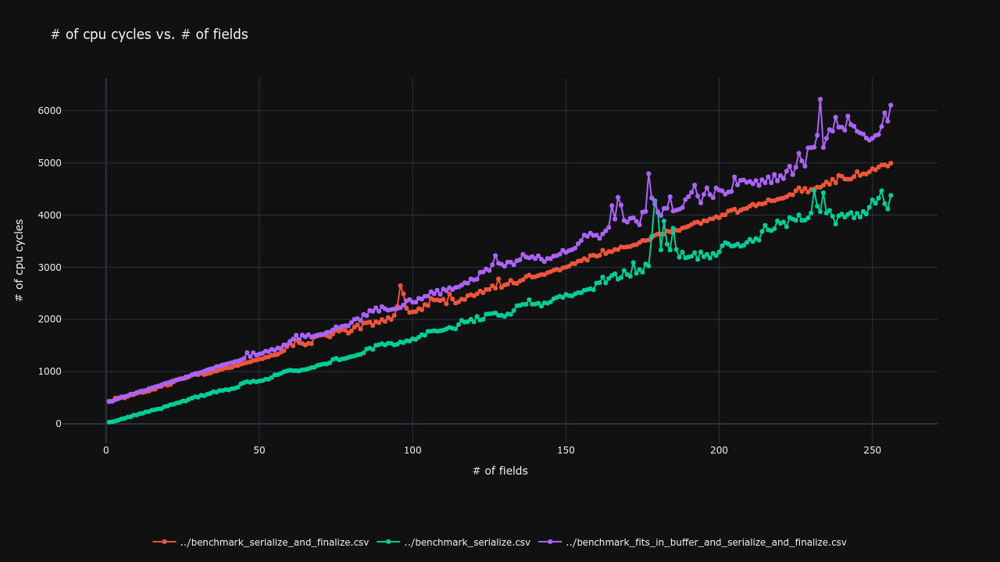
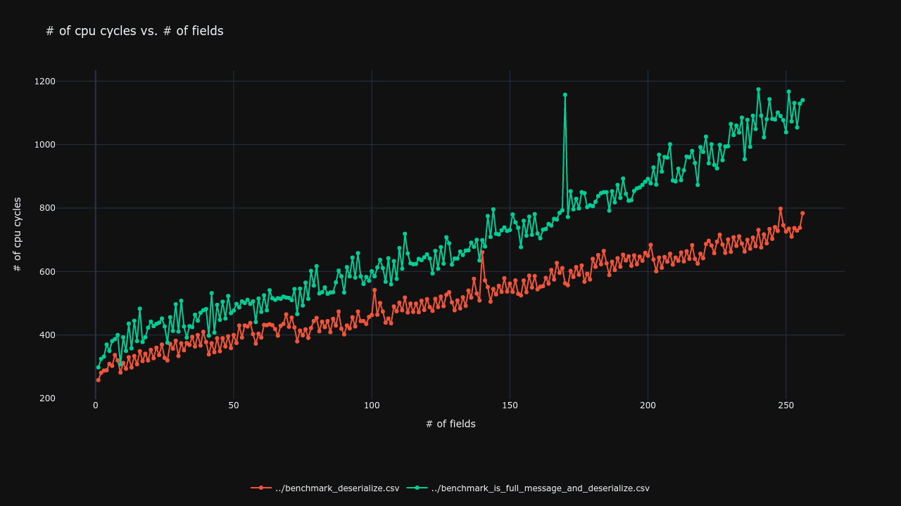
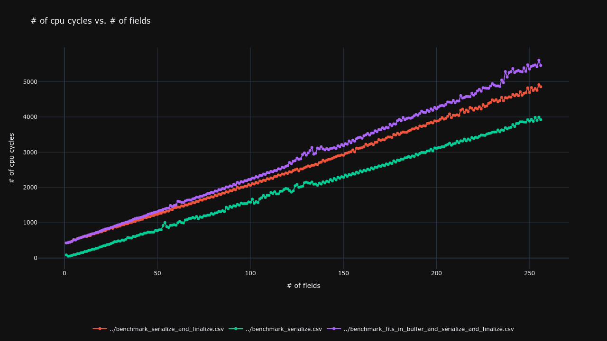
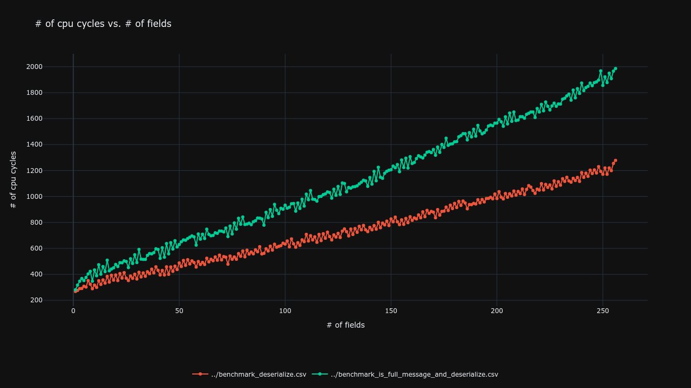

# FlashFIX

FlashFIX is a lightweight C library for serializing and deserializing FIX 4.4 messages. The library is designed for high performance and runs on hosts that support unaligned memory access.

## Benchmarks

The benchmarks are the result of 1 million iterations per test.
You can run your own benchmarks with ```sh cmake --build . --target benchmark``` and then launching the executable.

### AVX512
  *not tested yet, feel free to contribute*
### AVX2
  
  
### SSE
  
  
## Requirements

- gcc supporting c23.
- Host supporting unaligned memory access.

## Installation

**Building FlashFIX from source is strongly recommended** as the library makes use of available SIMD instruction sets for optimized performance. The precompiled package available on GitHub assumes the host supports AVX2 instructions.

To build the library, you'll need CMake. You can customize the maximum number of FIX fields by specifying the `FIX_MAX_FIELDS` variable at compile time.

For example, to set `FIX_MAX_FIELDS` to 512, run:

```sh
cmake . -DFIX_MAX_FIELDS=512
cmake --build .
sudo cmake --install .
```

## Documentation